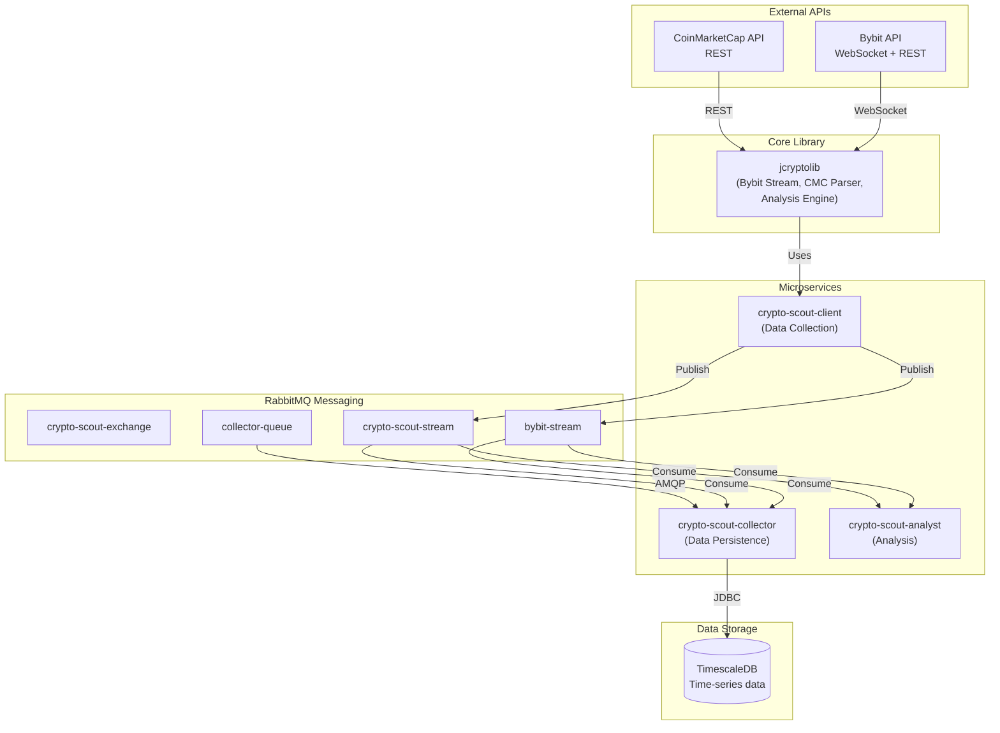

## What I Do

Provide comprehensive guidance on the architecture, design patterns, and system interactions within the crypto-scout ecosystem.

## System Overview



## Module Responsibilities

### crypto-scout-mq
**Purpose**: Messaging infrastructure

**Components**:
- RabbitMQ 4.1.4 with Streams and AMQP plugins
- Pre-configured exchanges, queues, and streams
- Stream retention policies (1 day, 2GB max)
- Dead-letter exchange for failed messages

**Deployment**: Podman Compose with persistent volumes

### crypto-scout-test
**Purpose**: Shared test utilities library

**Components**:
- `MockData` - Typed access to JSON test fixtures
- `PodmanCompose` - Container lifecycle management
- `StreamTestPublisher/Consumer` - RabbitMQ Streams test utilities
- `AmqpTestPublisher/Consumer` - AMQP test utilities
- `DBUtils` - Database operations for tests
- `Assertions` - Custom test assertions

**Usage**: Test-scoped dependency in other modules

### crypto-scout-client
**Purpose**: Real-time market data collection

**Data Sources**:
- **Bybit Spot**: BTCUSDT, ETHUSDT (tickers, trades, order books, klines)
- **Bybit Linear**: BTCUSDT, ETHUSDT (tickers, trades, liquidations, klines)
- **CoinMarketCap**: Fear & Greed Index, BTC/USD quotes

**Architecture**:
```
Client (Launcher)
├── CoreModule (Reactor, Executor)
├── WebModule (HTTP server, Health)
├── ClientModule (AmqpPublisher)
├── BybitSpotModule (WebSocket consumers)
├── BybitLinearModule (WebSocket consumers)
├── CmcParserModule (HTTP parser)
└── JmxModule (Monitoring)
```

**Publishing Strategy**:
- Bybit data → `bybit-stream`
- CMC data → `crypto-scout-stream`

### crypto-scout-collector
**Purpose**: Data persistence and storage

**Stream Consumers**:
- `bybit-stream` → BybitStreamService
- `crypto-scout-stream` → CryptoScoutService

**Data Flow**:
```
StreamService
├── BybitStreamService
│   ├── BybitSpotRepository (spot tables)
│   └── BybitLinearRepository (linear tables)
└── CryptoScoutService
    └── CryptoScoutRepository (fgi, klines, risk)
```

**Offset Management**: DB-backed offsets for exactly-once processing

### jcryptolib
**Purpose**: Core cryptocurrency library shared across all services

**Components**:
- **Bybit Streaming**: WebSocket client with resilience patterns
- **CMC Parser**: REST API client with scheduling
- **Analysis Engine**: Technical indicators (SMA, EMA, Bitcoin Risk)
- **Resilience**: Circuit breaker, rate limiter, health checks

**Usage**: Dependency for all other Java modules

### crypto-scout-analyst
**Purpose**: Market analysis and alerting

**Components**:
- Stream consumers with transformers
- DataService for async processing
- AnalystEngine integration from jcryptolib
- Real-time analysis pipeline

## Data Flow Patterns

### 1. Market Data Ingestion
```
Bybit WebSocket → crypto-scout-client → bybit-stream → crypto-scout-collector → TimescaleDB
```

### 2. Metrics Collection
```
CMC REST API → crypto-scout-client → crypto-scout-stream → crypto-scout-collector → TimescaleDB
```

### 3. Analysis Pipeline
```
Streams → crypto-scout-analyst → [Analysis] → Alerts/Signals
```

## Design Patterns

### 1. Launcher Pattern (ActiveJ)
```java
public final class Service extends Launcher {
    @Override
    protected Module getModule() {
        return combine(
            CoreModule.create(),      // Reactor + Executor
            ServiceModule.create(),   // Service-specific
            WebModule.create()        // HTTP + Health
        );
    }
    
    @Override
    protected void run() throws Exception {
        awaitShutdown();  // Block until SIGTERM
    }
}
```

### 2. Reactive Service Pattern
```java
public final class MyService extends AbstractReactive implements ReactiveService {
    @Override
    public Promise<Void> start() {
        return Promise.ofBlocking(executor, () -> {
            // Initialize resources
        });
    }
    
    @Override
    public Promise<Void> stop() {
        return Promise.ofBlocking(executor, () -> {
            // Cleanup resources
        });
    }
}
```

### 3. Repository Pattern
```java
public final class DataRepository {
    private final DataSource dataSource;
    
    public void saveBatch(final List<Data> data) throws SQLException {
        try (final var conn = dataSource.getConnection();
             final var stmt = conn.prepareStatement(SQL)) {
            for (final var d : data) {
                // set parameters
                stmt.addBatch();
            }
            stmt.executeBatch();
        }
    }
}
```

### 4. Factory Pattern
```java
public final class Service {
    public static Service create(final NioReactor reactor, 
                                  final Executor executor) {
        return new Service(reactor, executor);
    }
    
    private Service(final NioReactor reactor, final Executor executor) {
        // Private constructor
    }
}
```

## Configuration Management

### Hierarchy
1. **Bundled defaults**: `src/main/resources/application.properties`
2. **Environment variables**: Override via env vars
3. **System properties**: Override via `-D` flags

### Property Naming
```
server.port → SERVER_PORT
amqp.rabbitmq.host → AMQP_RABBITMQ_HOST
jdbc.datasource.url → JDBC_DATASOURCE_URL
```

### Pattern
```java
static final String VALUE = System.getProperty("key", "default");
```

## Error Handling Strategy

### Service Level
- Use `IllegalStateException` for invalid states
- Chain exceptions with causes
- Log errors with context

### Connection Level
- Retry with exponential backoff
- Circuit breaker pattern
- Graceful degradation

### Data Level
- Batch inserts with rollback
- Offset tracking for recovery
- Dead-letter queue for failures

## Scalability Considerations

### Horizontal Scaling
- **Client**: Multiple instances (stateless)
- **Collector**: Single instance per stream (offset management)
- **Analyst**: Multiple instances (consumer groups)

### Vertical Scaling
- **CPU**: Virtual threads for I/O bound work
- **Memory**: Bounded queues and streams
- **Storage**: Compression and retention policies

### Bottlenecks
- Database write capacity
- Network bandwidth
- Message broker throughput

## Security Architecture

### Network
- Internal network: `crypto-scout-bridge`
- No external exposure for services
- RabbitMQ management on localhost only

### Credentials
- Environment variables for secrets
- No hardcoded credentials
- File permissions on secret files (600)

### Container Security
- Non-root user (UID 10001)
- Read-only root filesystem
- Dropped capabilities
- No new privileges

## Monitoring and Observability

### Health Checks
```
GET /health → "ok" (200) or "not-ready" (503)
```

### Metrics
- JMX via ActiveJ
- Message throughput
- Database connection pool
- Error rates

### Logging
- SLF4J with Logback
- Structured logging
- Correlation IDs

## Deployment Strategy

### Development
```bash
# Local with Podman Compose
podman-compose up -d  # All services
```

### Production
```bash
# Individual service deployment
podman-compose up -d crypto-scout-client
podman-compose up -d crypto-scout-collector
```

### Upgrade Process
1. Build new image
2. Health check on staging
3. Rolling update (stop old, start new)
4. Verify health endpoints

## When to Use Me

Use this skill when:
- Understanding the overall system architecture
- Designing new features across modules
- Planning service interactions
- Considering scalability and deployment
- Reviewing security implications
- Troubleshooting cross-module issues
- Documenting system behavior
