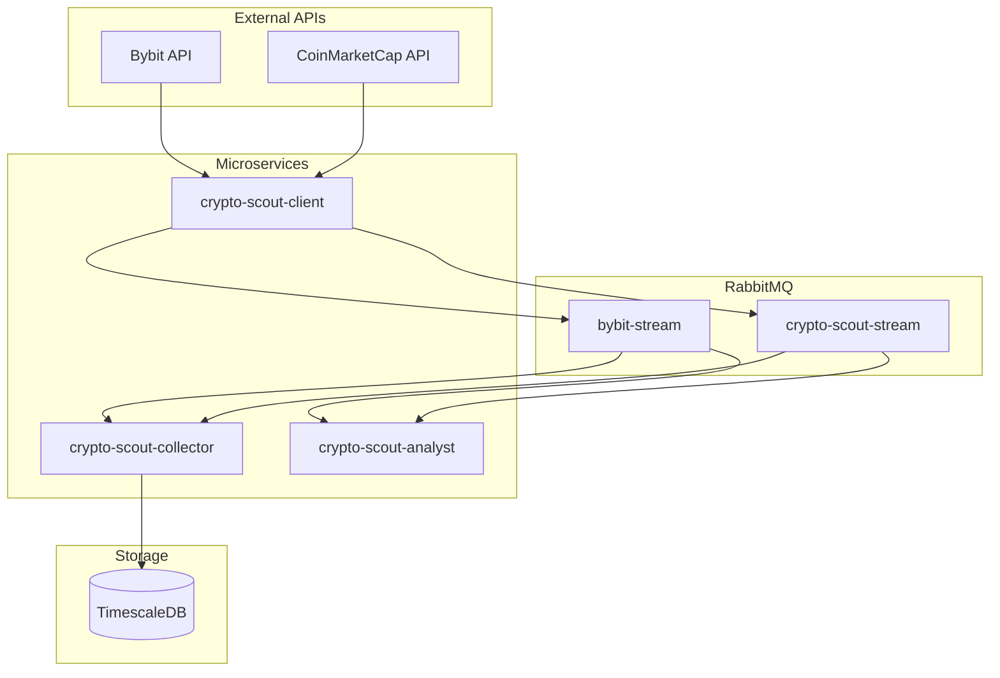

# AGENTS.md

This document provides guidelines for agentic coding contributors to the crypto-scout ecosystem.

## Project Overview

**crypto-scout** is a Java 25 multi-module Maven ecosystem for cryptocurrency market data collection, persistence, and analysis:

| Module | Purpose | Technology |
|--------|---------|------------|
| `crypto-scout-mq` | RabbitMQ infrastructure | RabbitMQ 4.1.4, Streams, AMQP |
| `crypto-scout-test` | Test support library | JUnit 6, Podman, Mock data |
| `crypto-scout-client` | Data collection service | ActiveJ, WebSocket, HTTP |
| `crypto-scout-collector` | Data persistence service | JDBC, TimescaleDB, HikariCP |
| `crypto-scout-analyst` | Analysis service | ActiveJ, Streams consumer |

## System Architecture



## Build, Test, and Lint Commands

### Full Build (All Modules)
```bash
mvn clean install              # Build with tests
mvn -q -DskipTests install     # Quick build without tests
```

### Module-Specific Builds
```bash
cd crypto-scout-client && mvn clean package
cd crypto-scout-collector && mvn clean package -DskipTests
```

### Testing
```bash
mvn test                                    # Run all tests
mvn test -Dtest=ClassName                   # Run single test class
mvn test -Dtest=ClassName#methodName        # Run single test method
mvn -q -Dpodman.compose.up.timeout.min=5 test  # Extended timeout
```

### Clean
```bash
mvn clean                      # Clean all modules
```

## Code Style Guidelines

### File Structure
```
1-23:   MIT License header (see template below)
25:     Package declaration
26:     Blank line
27+:    Imports: java.* → third-party → static imports (blank lines between groups)
        Blank line
        Class/enum/interface declaration
```

### MIT License Header Template
```java
/*
 * MIT License
 *
 * Copyright (c) 2026 Andrey Karazhev
 *
 * Permission is hereby granted, free of charge, to any person obtaining a copy
 * of this software and associated documentation files (the "Software"), to deal
 * in the Software without restriction, including without limitation the rights
 * to use, copy, modify, merge, publish, distribute, sublicense, and/or sell
 * copies of the Software, and to permit persons to whom the Software is
 * furnished to do so, subject to the following conditions:
 *
 * The above copyright notice and this permission notice shall be included in all
 * copies or substantial portions of the Software.
 *
 * THE SOFTWARE IS PROVIDED "AS IS", WITHOUT WARRANTY OF ANY KIND, EXPRESS OR
 * IMPLIED, INCLUDING BUT NOT LIMITED TO THE WARRANTIES OF MERCHANTABILITY,
 * FITNESS FOR A PARTICULAR PURPOSE AND NONINFRINGEMENT. IN NO EVENT SHALL THE
 * AUTHORS OR COPYRIGHT HOLDERS BE LIABLE FOR ANY CLAIM, DAMAGES OR OTHER
 * LIABILITY, WHETHER IN AN ACTION OF CONTRACT, TORT OR OTHERWISE, ARISING FROM,
 * OUT OF OR IN CONNECTION WITH THE SOFTWARE OR THE USE OR OTHER DEALINGS IN THE
 * SOFTWARE.
 */
```

### Import Organization
```java
import java.io.IOException;
import java.nio.file.Path;
import java.time.Duration;

import com.rabbitmq.stream.Environment;
import org.slf4j.Logger;
import org.slf4j.LoggerFactory;

import static com.github.akarazhev.cryptoscout.config.Constants.AmqpConfig.AMQP_RABBITMQ_HOST;
```

### Naming Conventions

| Element | Convention | Example |
|---------|------------|---------|
| Classes | PascalCase | `StreamService`, `AmqpPublisher` |
| Methods | camelCase with verb prefix | `waitForDatabaseReady`, `deleteFromTables` |
| Constants | UPPER_SNAKE_CASE in nested static classes | `JDBC_URL`, `DB_USER` |
| Parameters/locals | `final var` | `final var timeout`, `final var data` |
| Test classes | `<ClassName>Test` suffix | `AmqpPublisherTest` |
| Test methods | `should<Subject><Action>` pattern | `shouldPublishPayloadToStream` |

### Access Modifiers

**Utility Classes:**
```java
final class Constants {
    private Constants() {
        throw new UnsupportedOperationException();
    }
    
    static final String PATH_SEPARATOR = "/";
    
    final static class DB {
        private DB() {
            throw new UnsupportedOperationException();
        }
        
        static final String JDBC_URL = System.getProperty("test.db.jdbc.url", "...");
    }
}
```

**Factory Pattern:**
```java
public final class Service extends AbstractReactive implements ReactiveService {
    public static Service create(final NioReactor reactor, final Executor executor) {
        return new Service(reactor, executor);
    }
    
    private Service(final NioReactor reactor, final Executor executor) {
        super(reactor);
        this.executor = executor;
    }
}
```

### Error Handling

**Unchecked Exceptions:**
```java
if (resource == null) {
    throw new IllegalStateException("Resource not found: " + name);
}
```

**Try-with-Resources:**
```java
try (final var conn = dataSource.getConnection();
     final var stmt = conn.prepareStatement(sql);
     final var rs = stmt.executeQuery()) {
    while (rs.next()) {
        // Process results
    }
} catch (final SQLException e) {
    throw new IllegalStateException("Database error", e);
}
```

**Interrupt Handling:**
```java
try {
    Thread.sleep(duration.toMillis());
} catch (final InterruptedException e) {
    Thread.currentThread().interrupt();
}
```

**Exception Chaining:**
```java
throw new IllegalStateException("Failed to initialize service", e);
```

### Logging
```java
private static final Logger LOGGER = LoggerFactory.getLogger(ClassName.class);

LOGGER.info("Service started on port {}", port);
LOGGER.warn("Connection lost, retrying...");
LOGGER.error("Failed to process message", exception);
```

## Testing (JUnit 6/Jupiter)

### Test Class Structure
```java
final class ExampleTest {
    
    @BeforeAll
    static void setUp() {
        PodmanCompose.up();
    }
    
    @AfterAll
    static void tearDown() {
        PodmanCompose.down();
    }
    
    @Test
    void shouldBehaviorReturnExpected() throws Exception {
        final var result = service.doSomething();
        assertNotNull(result);
        assertEquals(expected, result);
    }
}
```

### Mock Data Usage
```java
final var spotKlines = MockData.get(
    MockData.Source.BYBIT_SPOT, 
    MockData.Type.KLINE_1
);

final var fgi = MockData.get(
    MockData.Source.CRYPTO_SCOUT, 
    MockData.Type.FGI
);
```

## Configuration

### System Properties Pattern
```java
static final String VALUE = System.getProperty("property.key", "defaultValue");
static final int PORT = Integer.parseInt(System.getProperty("port.key", "5552"));
static final Duration TIMEOUT = Duration.ofMinutes(Long.getLong("timeout.key", 3L));
```

### Environment Variable Mapping
| Property | Environment Variable |
|----------|---------------------|
| `server.port` | `SERVER_PORT` |
| `amqp.rabbitmq.host` | `AMQP_RABBITMQ_HOST` |
| `jdbc.datasource.url` | `JDBC_DATASOURCE_URL` |

## Module-Specific Guidelines

### crypto-scout-test (Test Library)
- Mock data fixtures in `src/main/resources/`
- PodmanCompose for container lifecycle management
- StreamTestPublisher/Consumer for RabbitMQ Streams testing
- AmqpTestPublisher/Consumer for AMQP testing
- DBUtils for database test operations

### crypto-scout-client (Data Collection)
- ActiveJ modules: CoreModule, WebModule, ClientModule, BybitSpotModule, BybitLinearModule, CmcParserModule
- AmqpPublisher routes payloads to streams based on provider
- Health endpoint at `/health` for container orchestration
- Module toggles: `bybit.stream.module.enabled`, `cmc.parser.module.enabled`

### crypto-scout-collector (Data Persistence)
- StreamService consumes from RabbitMQ Streams
- BybitStreamService and CryptoScoutService for data processing
- Repository pattern for database access
- Offset management in `crypto_scout.stream_offsets` table

### crypto-scout-analyst (Analysis)
- Subscribes to streams for real-time analysis
- Placeholder for future analytical capabilities

## Key Dependencies

| Dependency | Version | Purpose |
|------------|---------|---------|
| Java | 25 | Language |
| ActiveJ | 6.0-rc2 | Async I/O framework |
| jcryptolib | 0.0.4 | JSON utilities, clients |
| RabbitMQ Stream Client | 1.4.0 | Streams protocol |
| AMQP Client | 5.28.0 | AMQP protocol |
| PostgreSQL | 42.7.9 | Database driver |
| HikariCP | 7.0.2 | Connection pooling |
| JUnit | 6.1.0-M1 | Testing |

## Resource Management

- **Try-with-resources**: Required for all closeable resources
- **Null checks**: Throw `IllegalStateException` with descriptive message
- **Timeout handling**: Include timeout value in error message
- **Process management**: `destroyForcibly()` after timeout

## Concurrency

- **Volatile fields**: For lazy-initialized singleton-style fields
- **Thread naming**: Provide names for background threads
- **Daemon threads**: Set for readers that shouldn't block JVM shutdown
- **Interrupt status**: Always restore when catching `InterruptedException`

## Container Development

### Start Infrastructure
```bash
# Create network
podman network create crypto-scout-bridge

# Start RabbitMQ
cd crypto-scout-mq && podman-compose up -d

# Start TimescaleDB
cd crypto-scout-collector && podman-compose up -d crypto-scout-collector-db
```

### Build and Run Services
```bash
# Build all modules
mvn -q -DskipTests install

# Run client
java -jar crypto-scout-client/target/crypto-scout-client-0.0.1.jar

# Run collector
java -jar crypto-scout-collector/target/crypto-scout-collector-0.0.1.jar
```

### Health Checks
```bash
# RabbitMQ
curl http://localhost:15672/api/health/checks/virtual-hosts -u crypto_scout_mq:password

# TimescaleDB
podman exec crypto-scout-collector-db pg_isready -U crypto_scout_db

# Services
curl http://localhost:8081/health
```

## Security Best Practices

- **No hardcoded credentials** - Use environment variables or system properties
- **Secret files** - Store in `secret/` directory with 600 permissions
- **Container security** - Non-root user, read-only filesystem, dropped capabilities
- **Validation** - Validate all configuration at startup

## Troubleshooting

### Build Issues
```bash
# Clear local Maven cache
rm -rf ~/.m2/repository/com/github/akarazhev
mvn clean install
```

### Container Issues
```bash
# View logs
podman logs crypto-scout-mq
podman logs crypto-scout-collector-db

# Check network
podman network inspect crypto-scout-bridge

# Restart services
podman-compose restart
```

### Database Issues
```bash
# Connect to database
podman exec -it crypto-scout-collector-db psql -U crypto_scout_db -d crypto_scout

# List tables
\dt crypto_scout.*

# Check table counts
SELECT COUNT(*) FROM crypto_scout.bybit_spot_tickers;
```

## License

MIT License - See `LICENSE` file.
