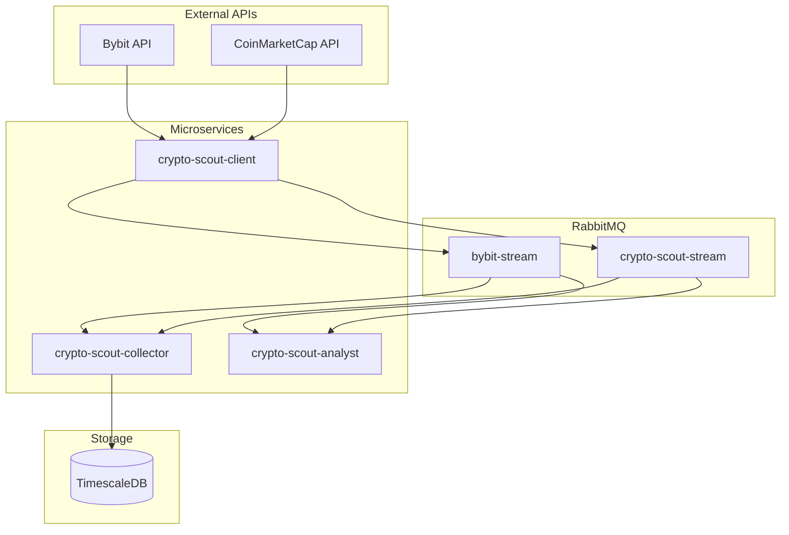

# AGENTS.md

This document provides guidelines for agentic coding contributors to the crypto-scout ecosystem.

## Project Overview

**crypto-scout** is a Java 25 multi-module Maven ecosystem for cryptocurrency market data collection, persistence, and analysis:

## MCP Server Configuration

This project uses the **Context7 MCP server** for enhanced code intelligence and documentation retrieval.

### Available MCP Tools

When working with this codebase, you can use the following MCP tools via the context7 server:

- **resolve-library-id**: Resolve a library name to its Context7 library ID
- **get-library-docs**: Retrieve up-to-date documentation for a library by its ID

### Configuration

The MCP server is configured in `.opencode/package.json`:

```json
{
  "mcp": {
    "context7": {
      "type": "remote",
      "url": "https://mcp.context7.com/mcp",
      "headers": {
        "CONTEXT7_API_KEY": "{env:CONTEXT7_API_KEY}"
      },
      "enabled": true
    }
  }
}
```

**Note:** The API key is loaded from the `CONTEXT7_API_KEY` environment variable. Set it before running OpenCode:
```bash
export CONTEXT7_API_KEY="your-api-key-here"
```

**Important:** The MCP server must be configured in your **global OpenCode config** (`~/.config/opencode/opencode.json`) to be active. The project's `.opencode/package.json` serves as documentation and reference for the expected configuration. See the root project's AGENTS.md for the complete global configuration.

### Usage Guidelines

1. **Library Documentation**: Use `resolve-library-id` followed by `get-library-docs` to fetch the latest documentation for:
   - ActiveJ framework APIs
   - RabbitMQ Stream Client
   - PostgreSQL/JDBC drivers
   - ta4j technical analysis library
   - DSL-JSON serialization

2. **Code Context**: When implementing features across modules, retrieve relevant library docs to ensure correct API usage.

3. **Best Practices**: Always verify against the latest documentation versions available through the MCP server.

| Module | Purpose | Technology | Version | Java Files |
|--------|---------|------------|---------|------------|
| `jcryptolib` | Core cryptocurrency library | ActiveJ, DSL-JSON, ta4j | 0.0.4 | ~70 |
| `crypto-scout-mq` | RabbitMQ infrastructure | RabbitMQ 4.1.4, Streams, AMQP | - | 0 |
| `crypto-scout-test` | Test support library | JUnit 6, Podman, Mock data | 0.0.1 | ~15 |
| `crypto-scout-client` | Data collection service | ActiveJ, WebSocket, HTTP | 0.0.1 | ~15 |
| `crypto-scout-collector` | Data persistence service | JDBC, TimescaleDB, HikariCP | 0.0.1 | ~30 |
| `crypto-scout-analyst` | Analysis service | ActiveJ, Streams consumer | 0.0.1 | ~25 |

**Total: ~155 Java source files across 5 Java modules**

## Directory Structure

```
crypto-scout/                    # Root Aggregator (Maven parent)
├── .opencode/                   # OpenCode configuration
│   ├── agents/                  # Agent definitions (developer, reviewer, writer)
│   └── skills/                  # Skill definitions
├── crypto-scout-mq/             # RabbitMQ Infrastructure (non-Java module)
│   ├── rabbitmq/                # RabbitMQ config files
│   ├── script/                  # Setup scripts
│   └── secret/                  # Environment secrets
├── jcryptolib/                  # Core Library (v0.0.4)
│   ├── doc/                     # Documentation and specs
│   └── src/
│       ├── main/java/           # ~40 source files
│       │   ├── analysis/        # Analysis engine and indicators
│       │   ├── bybit/           # Bybit streaming client
│       │   ├── cmc/             # CoinMarketCap parser
│       │   ├── config/          # Configuration
│       │   ├── exception/       # 10 exception types
│       │   ├── resilience/      # Circuit breaker, rate limiter
│       │   ├── stream/          # Stream abstractions
│       │   └── util/            # JSON, time, security utilities
│       └── test/java/           # ~30 test files
├── crypto-scout-test/           # Test Support Library (v0.0.1)
│   └── src/
│       ├── main/                # Test utilities and mock data
│       │   ├── java/            # PodmanCompose, MockData, publishers
│       │   └── resources/       # Mock JSON data, SQL scripts
│       └── test/java/           # Self-tests for test library
├── crypto-scout-client/         # Data Collection Service (v0.0.1)
│   └── src/main/java/           # Client.java launcher, consumers
├── crypto-scout-collector/      # Data Persistence Service (v0.0.1)
│   ├── script/                  # SQL table definitions
│   └── src/
│       ├── main/java/           # Collector.java launcher, repositories
│       └── test/java/           # Repository and service tests
└── crypto-scout-analyst/        # Analysis Service (v0.0.1)
    ├── script/                  # SQL init scripts
    └── src/
        ├── main/java/           # Analyst.java launcher, transformers
        └── test/java/           # Data service tests
```

## System Architecture



## Build, Test, and Lint Commands

### Full Build (All Modules)
```bash
mvn clean install              # Build with tests
mvn -q -DskipTests install     # Quick build without tests
```

### Module-Specific Builds
```bash
cd crypto-scout-client && mvn clean package
cd crypto-scout-collector && mvn clean package -DskipTests
```

### Testing
```bash
mvn test                                    # Run all tests
mvn test -Dtest=ClassName                   # Run single test class
mvn test -Dtest=ClassName#methodName        # Run single test method
mvn -q -Dpodman.compose.up.timeout.min=5 test  # Extended timeout
```

### Clean
```bash
mvn clean                      # Clean all modules
```

## Code Style Guidelines

### File Structure
```
1-23:   MIT License header (see template below)
25:     Package declaration
26:     Blank line
27+:    Imports: java.* → third-party → static imports (blank lines between groups)
        Blank line
        Class/enum/interface declaration
```

### MIT License Header Template
```java
/*
 * MIT License
 *
 * Copyright (c) 2026 Andrey Karazhev
 *
 * Permission is hereby granted, free of charge, to any person obtaining a copy
 * of this software and associated documentation files (the "Software"), to deal
 * in the Software without restriction, including without limitation the rights
 * to use, copy, modify, merge, publish, distribute, sublicense, and/or sell
 * copies of the Software, and to permit persons to whom the Software is
 * furnished to do so, subject to the following conditions:
 *
 * The above copyright notice and this permission notice shall be included in all
 * copies or substantial portions of the Software.
 *
 * THE SOFTWARE IS PROVIDED "AS IS", WITHOUT WARRANTY OF ANY KIND, EXPRESS OR
 * IMPLIED, INCLUDING BUT NOT LIMITED TO THE WARRANTIES OF MERCHANTABILITY,
 * FITNESS FOR A PARTICULAR PURPOSE AND NONINFRINGEMENT. IN NO EVENT SHALL THE
 * AUTHORS OR COPYRIGHT HOLDERS BE LIABLE FOR ANY CLAIM, DAMAGES OR OTHER
 * LIABILITY, WHETHER IN AN ACTION OF CONTRACT, TORT OR OTHERWISE, ARISING FROM,
 * OUT OF OR IN CONNECTION WITH THE SOFTWARE OR THE USE OR OTHER DEALINGS IN THE
 * SOFTWARE.
 */
```

### Import Organization
```java
import java.io.IOException;
import java.nio.file.Path;
import java.time.Duration;

import com.rabbitmq.stream.Environment;
import org.slf4j.Logger;
import org.slf4j.LoggerFactory;

import static com.github.akarazhev.cryptoscout.config.Constants.AmqpConfig.AMQP_RABBITMQ_HOST;
```

### Naming Conventions

| Element | Convention | Example |
|---------|------------|---------|
| Classes | PascalCase | `StreamService`, `AmqpPublisher` |
| Methods | camelCase with verb prefix | `waitForDatabaseReady`, `deleteFromTables` |
| Constants | UPPER_SNAKE_CASE in nested static classes | `JDBC_URL`, `DB_USER` |
| Parameters/locals | `final var` | `final var timeout`, `final var data` |
| Test classes | `<ClassName>Test` suffix | `AmqpPublisherTest` |
| Test methods | `should<Subject><Action>` pattern | `shouldPublishPayloadToStream` |

### Access Modifiers

**Utility Classes:**
```java
final class Constants {
    private Constants() {
        throw new UnsupportedOperationException();
    }
    
    static final String PATH_SEPARATOR = "/";
    
    final static class DB {
        private DB() {
            throw new UnsupportedOperationException();
        }
        
        static final String JDBC_URL = System.getProperty("test.db.jdbc.url", "...");
    }
}
```

**Factory Pattern:**
```java
public final class Service extends AbstractReactive implements ReactiveService {
    public static Service create(final NioReactor reactor, final Executor executor) {
        return new Service(reactor, executor);
    }
    
    private Service(final NioReactor reactor, final Executor executor) {
        super(reactor);
        this.executor = executor;
    }
}
```

### Error Handling

**Unchecked Exceptions:**
```java
if (resource == null) {
    throw new IllegalStateException("Resource not found: " + name);
}
```

**Try-with-Resources:**
```java
try (final var conn = dataSource.getConnection();
     final var stmt = conn.prepareStatement(sql);
     final var rs = stmt.executeQuery()) {
    while (rs.next()) {
        // Process results
    }
} catch (final SQLException e) {
    throw new IllegalStateException("Database error", e);
}
```

**Interrupt Handling:**
```java
try {
    Thread.sleep(duration.toMillis());
} catch (final InterruptedException e) {
    Thread.currentThread().interrupt();
}
```

**Exception Chaining:**
```java
throw new IllegalStateException("Failed to initialize service", e);
```

### Logging
```java
private static final Logger LOGGER = LoggerFactory.getLogger(ClassName.class);

LOGGER.info("Service started on port {}", port);
LOGGER.warn("Connection lost, retrying...");
LOGGER.error("Failed to process message", exception);
```

## Testing (JUnit 6/Jupiter)

### Test Class Structure
```java
final class ExampleTest {
    
    @BeforeAll
    static void setUp() {
        PodmanCompose.up();
    }
    
    @AfterAll
    static void tearDown() {
        PodmanCompose.down();
    }
    
    @Test
    void shouldBehaviorReturnExpected() throws Exception {
        final var result = service.doSomething();
        assertNotNull(result);
        assertEquals(expected, result);
    }
}
```

### Mock Data Usage
```java
final var spotKlines = MockData.get(
    MockData.Source.BYBIT_SPOT, 
    MockData.Type.KLINE_1
);

final var fgi = MockData.get(
    MockData.Source.CRYPTO_SCOUT, 
    MockData.Type.FGI
);
```

## Configuration

### System Properties Pattern
```java
static final String VALUE = System.getProperty("property.key", "defaultValue");
static final int PORT = Integer.parseInt(System.getProperty("port.key", "5552"));
static final Duration TIMEOUT = Duration.ofMinutes(Long.getLong("timeout.key", 3L));
```

### Environment Variable Mapping
| Property | Environment Variable |
|----------|---------------------|
| `server.port` | `SERVER_PORT` |
| `amqp.rabbitmq.host` | `AMQP_RABBITMQ_HOST` |
| `jdbc.datasource.url` | `JDBC_DATASOURCE_URL` |

## Module-Specific Guidelines

### jcryptolib (Core Library) - ~70 files
Located in: `jcryptolib/src/main/java/com/github/akarazhev/jcryptolib/`

**Packages:**
- `analysis/` - Analysis engine with indicators (SMA, EMA, Bitcoin Risk)
- `bybit/stream/` - WebSocket client with auto-reconnection, circuit breaker, ping/pong
- `cmc/parser/` - REST API client with rate limiting and scheduling
- `config/` - Application configuration
- `exception/` - 10 exception types (ApiException, BybitApiException, CmcApiException, etc.)
- `resilience/` - Circuit breaker, rate limiter, health checks
- `stream/` - Stream abstractions (Payload, Provider, Source, Statistic, RestMetrics)
- `util/` - JsonUtils, ParserUtils, TimeUtils, ValueUtils, SecUtils

### crypto-scout-test (Test Library) - ~15 files
Located in: `crypto-scout-test/src/main/java/com/github/akarazhev/cryptoscout/test/`

**Key Classes:**
- `PodmanCompose` - Container lifecycle management
- `MockData` - Mock data fixtures (bybit-spot, bybit-linear, crypto-scout)
- `StreamTestPublisher` / `StreamTestConsumer` - RabbitMQ Streams testing
- `AmqpTestPublisher` / `AmqpTestConsumer` - AMQP testing
- `DBUtils` - Database test operations
- `Assertions` - Custom test assertions

**Resources:** `src/main/resources/` contains:
- `bybit-spot/` - Spot market mock data (tickers, klines, orderbook)
- `bybit-linear/` - Linear market mock data (tickers, klines, orderbook)
- `crypto-scout/` - Crypto scout mock data (FGI, BTC risk, LPL)
- `podman/` - Test container configuration

### crypto-scout-client (Data Collection) - ~15 files
Located in: `crypto-scout-client/src/main/java/com/github/akarazhev/cryptoscout/`

**Launcher:** `Client.java`

**ActiveJ Modules:**
- `CoreModule` - Core dependency injection
- `WebModule` - HTTP server with health endpoint at `/health`
- `ClientModule` - Client configuration
- `BybitSpotModule` - Bybit spot market consumers
- `BybitLinearModule` - Bybit linear market consumers
- `CmcParserModule` - CoinMarketCap parser consumer

**Consumers:**
- `BybitSpotBtcUsdtConsumer` / `BybitSpotEthUsdtConsumer`
- `BybitLinearBtcUsdtConsumer` / `BybitLinearEthUsdtConsumer`
- `CmcParserConsumer`

**Publishing:** `AmqpPublisher` routes payloads to streams based on provider

### crypto-scout-collector (Data Persistence) - ~30 files
Located in: `crypto-scout-collector/src/main/java/com/github/akarazhev/cryptoscout/`

**Launcher:** `Collector.java`

**Stream Processing:**
- `StreamService` - Consumes from RabbitMQ Streams
- `BybitStreamService` - Bybit data processing
- `CryptoScoutService` - Crypto scout data processing
- `DataService` - General data operations

**Repositories:**
- `BybitSpotRepository` - Spot market persistence
- `BybitLinearRepository` - Linear market persistence
- `CryptoScoutRepository` - Crypto scout data persistence
- `AnalystRepository` - Analysis results persistence
- `StreamOffsetsRepository` - Offset management

**Database:**
- `CollectorDataSource` - HikariCP connection pool
- Offset management in `crypto_scout.stream_offsets` table

**SQL Scripts:** Located in `script/`
- `bybit_spot_tables.sql` - Spot market table definitions
- `bybit_linear_tables.sql` - Linear market table definitions
- `crypto_scout_tables.sql` - Crypto scout table definitions
- `analyst_tables.sql` - Analysis table definitions

### crypto-scout-analyst (Analysis) - ~25 files
Located in: `crypto-scout-analyst/src/main/java/com/github/akarazhev/cryptoscout/`

**Launcher:** `Analyst.java`

**Stream Processing:**
- `StreamService` - Stream subscription and management
- `StreamIn` - Stream input handling
- `BytesToPayloadTransformer` - Byte[] to Payload transformation
- `AnalystTransformer` - Analysis transformation logic
- `StreamPublisher` - Output publishing
- `MessageSupplier` - Message supply for streams

**Services:**
- `BybitStreamService` - Bybit stream analysis
- `CryptoScoutService` - Crypto scout analysis
- `DataService` - Async data processing with ActiveJ datastreams
- `HealthService` - Health check endpoint

**Database:**
- `AnalystDataSource` - Connection pool
- `StreamOffsetsRepository` - Offset tracking

### crypto-scout-mq (Infrastructure)
Located in: `crypto-scout-mq/` (non-Java module)

**Configuration:**
- `rabbitmq/rabbitmq.conf` - RabbitMQ configuration
- `rabbitmq/definitions.json` - Queue/stream definitions
- `rabbitmq/enabled_plugins` - Enabled plugins (streams, management)

**Scripts:**
- `script/network.sh` - Network setup
- `script/rmq_compose.sh` - Container orchestration
- `script/rmq_user.sh` - User management

**Secrets:** `secret/rabbitmq.env` - Credentials (600 permissions)

## Key Dependencies

| Dependency | Version | Purpose |
|------------|---------|---------|
| Java | 25 | Language |
| ActiveJ | 6.0-rc2 | Async I/O framework |
| jcryptolib | 0.0.4 | JSON utilities, clients |
| RabbitMQ Stream Client | 1.4.0 | Streams protocol |
| AMQP Client | 5.28.0 | AMQP protocol |
| PostgreSQL | 42.7.9 | Database driver |
| HikariCP | 7.0.2 | Connection pooling |
| JUnit | 6.1.0-M1 | Testing |
| DSL-JSON | 2.0.2 | JSON parsing |
| ta4j | 0.22.1 | Technical analysis |

## Resource Management

- **Try-with-resources**: Required for all closeable resources
- **Null checks**: Throw `IllegalStateException` with descriptive message
- **Timeout handling**: Include timeout value in error message
- **Process management**: `destroyForcibly()` after timeout

## Concurrency

- **Volatile fields**: For lazy-initialized singleton-style fields
- **Thread naming**: Provide names for background threads
- **Daemon threads**: Set for readers that shouldn't block JVM shutdown
- **Interrupt status**: Always restore when catching `InterruptedException`

## Container Development

### Start Infrastructure
```bash
# Create network
podman network create crypto-scout-bridge

# Start RabbitMQ
cd crypto-scout-mq && podman-compose up -d

# Start TimescaleDB
cd crypto-scout-collector && podman-compose up -d crypto-scout-collector-db
```

### Build and Run Services
```bash
# Build all modules
mvn -q -DskipTests install

# Run client
java -jar crypto-scout-client/target/crypto-scout-client-0.0.1.jar

# Run collector
java -jar crypto-scout-collector/target/crypto-scout-collector-0.0.1.jar

# Run analyst
java -jar crypto-scout-analyst/target/crypto-scout-analyst-0.0.1.jar
```

### Health Checks
```bash
# RabbitMQ
curl http://localhost:15672/api/health/checks/virtual-hosts -u crypto_scout_mq:password

# TimescaleDB
podman exec crypto-scout-collector-db pg_isready -U crypto_scout_db

# Services
curl http://localhost:8081/health  # Client
curl http://localhost:8082/health  # Collector
curl http://localhost:8083/health  # Analyst
```

## Security Best Practices

- **No hardcoded credentials** - Use environment variables or system properties
- **Secret files** - Store in `secret/` directory with 600 permissions
- **Container security** - Non-root user, read-only filesystem, dropped capabilities
- **Validation** - Validate all configuration at startup

## Troubleshooting

### Build Issues
```bash
# Clear local Maven cache
rm -rf ~/.m2/repository/com/github/akarazhev
mvn clean install
```

### Container Issues
```bash
# View logs
podman logs crypto-scout-mq
podman logs crypto-scout-collector-db

# Check network
podman network inspect crypto-scout-bridge

# Restart services
podman-compose restart
```

### Database Issues
```bash
# Connect to database
podman exec -it crypto-scout-collector-db psql -U crypto_scout_db -d crypto_scout

# List tables
\dt crypto_scout.*

# Check table counts
SELECT COUNT(*) FROM crypto_scout.bybit_spot_tickers;
SELECT COUNT(*) FROM crypto_scout.bybit_linear_tickers;
SELECT COUNT(*) FROM crypto_scout.crypto_scout_fgi;
```

## License

MIT License - See `LICENSE` file.
