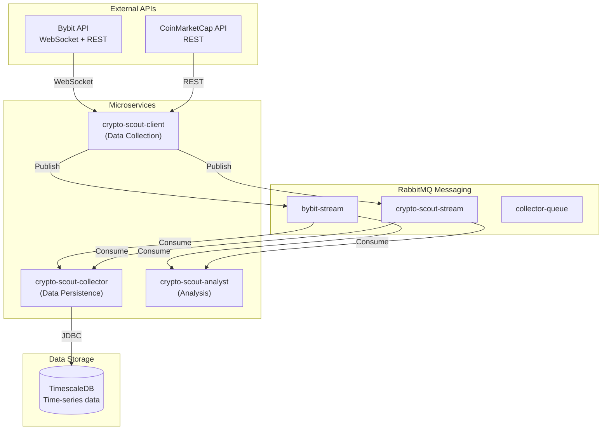

# crypto-scout

A production-ready Java 25 microservices ecosystem for cryptocurrency market data collection, persistence, and analysis. Built with ActiveJ for high-performance async I/O, RabbitMQ Streams for messaging, and TimescaleDB for time-series data storage.

## Overview

crypto-scout collects real-time market data from Bybit (Spot and Linear/Perpetual) and CoinMarketCap, persists it to TimescaleDB, and provides a foundation for market analysis and alerting.

### Architecture



## Modules

| Module | Purpose | Technology |
|--------|---------|------------|
| [crypto-scout-mq](crypto-scout-mq/) | RabbitMQ infrastructure with Streams and AMQP | RabbitMQ 4.1.4 |
| [crypto-scout-test](crypto-scout-test/) | Shared test utilities and mock data | JUnit 6, Podman |
| [crypto-scout-client](crypto-scout-client/) | Real-time data collection from Bybit and CMC | ActiveJ, WebSocket |
| [crypto-scout-collector](crypto-scout-collector/) | Data persistence to TimescaleDB | JDBC, HikariCP |
| [crypto-scout-analyst](crypto-scout-analyst/) | Market analysis and alerting (WIP) | ActiveJ |

## Features

- **Real-time Data Collection**: WebSocket connections to Bybit Spot and Linear markets
- **Market Metrics**: Fear & Greed Index, BTC/USD historical data from CoinMarketCap
- **Time-series Storage**: Optimized hypertables with compression and retention policies
- **Exactly-once Processing**: Database-backed offset management for stream consumers
- **Containerized Deployment**: Podman Compose with security hardening
- **Health Monitoring**: HTTP health endpoints for container orchestration
- **Comprehensive Testing**: Mock data fixtures, integration test infrastructure

## Quick Start

### Prerequisites

- Java 25 JDK (Temurin recommended)
- Maven 3.9+
- Podman and podman-compose
- 8GB RAM minimum

### 1. Clone and Build

```bash
git clone <repository-url>
cd crypto-scout
mvn -q -DskipTests install
```

### 2. Start Infrastructure

```bash
# Create network
podman network create crypto-scout-bridge

# Start RabbitMQ
cd crypto-scout-mq
cp secret/rabbitmq.env.example secret/rabbitmq.env
# Edit secret/rabbitmq.env with secure credentials
podman-compose up -d

# Start TimescaleDB
cd ../crypto-scout-collector
cp secret/timescaledb.env.example secret/timescaledb.env
cp secret/collector.env.example secret/collector.env
# Edit env files with secure credentials
podman-compose up -d crypto-scout-collector-db
```

### 3. Run Services

```bash
# Terminal 1: Run client
java -jar crypto-scout-client/target/crypto-scout-client-0.0.1.jar

# Terminal 2: Run collector
java -jar crypto-scout-collector/target/crypto-scout-collector-0.0.1.jar

# Terminal 3: Run analyst (optional)
java -jar crypto-scout-analyst/target/crypto-scout-analyst-0.0.1.jar
```

### 4. Verify

```bash
# Check RabbitMQ Management UI
open http://localhost:15672

# Check service health
curl http://localhost:8081/health
# -> ok

# Query database
podman exec -it crypto-scout-collector-db psql -U crypto_scout_db -d crypto_scout -c "SELECT COUNT(*) FROM crypto_scout.bybit_spot_tickers;"
```

## Configuration

All services use a hierarchical configuration system:

1. **Bundled defaults**: `src/main/resources/application.properties`
2. **Environment variables**: Override via env vars
3. **System properties**: Override via `-D` flags

### Key Configuration Properties

| Property | Default | Description |
|----------|---------|-------------|
| `server.port` | `8081` | HTTP server port |
| `amqp.rabbitmq.host` | `localhost` | RabbitMQ host |
| `amqp.stream.port` | `5552` | RabbitMQ Streams port |
| `amqp.rabbitmq.username` | `crypto_scout_mq` | RabbitMQ username |
| `jdbc.datasource.url` | `jdbc:postgresql://localhost:5432/crypto_scout` | Database URL |

Environment variables use UPPER_SNAKE_CASE with underscores: `SERVER_PORT`, `AMQP_RABBITMQ_HOST`.

## Database Schema

The TimescaleDB schema includes tables for:

### Bybit Spot
- `crypto_scout.bybit_spot_tickers` - Real-time ticker data
- `crypto_scout.bybit_spot_kline_{1m,5m,15m,60m,240m,1d}` - Candlestick data
- `crypto_scout.bybit_spot_public_trade` - Trade history
- `crypto_scout.bybit_spot_order_book_{1,50,200,1000}` - Order book snapshots

### Bybit Linear
- `crypto_scout.bybit_linear_tickers` - Perpetual contract tickers
- `crypto_scout.bybit_linear_kline_{1m,5m,15m,60m,240m,1d}` - Perp candlesticks
- `crypto_scout.bybit_linear_public_trade` - Perp trades
- `crypto_scout.bybit_linear_all_liquidation` - Liquidation events

### Crypto Scout
- `crypto_scout.cmc_fgi` - Fear & Greed Index
- `crypto_scout.cmc_kline_{1d,1w}` - BTC/USD historical data
- `crypto_scout.btc_price_risk` - Risk-to-price mapping
- `crypto_scout.stream_offsets` - Consumer offset tracking

All tables use TimescaleDB hypertables with compression and retention policies.

## Development

### Building

```bash
# Full build with tests
mvn clean install

# Quick build without tests
mvn -q -DskipTests install

# Build single module
cd crypto-scout-client && mvn clean package
```

### Testing

```bash
# Run all tests
mvn test

# Run specific test class
mvn test -Dtest=AmqpPublisherTest

# Run with extended timeout for slow environments
mvn -q -Dpodman.compose.up.timeout.min=5 test
```

### Code Style

- Java 25 with `final var` for local variables
- MIT License header on all files
- Imports: `java.*` → third-party → static imports
- Constants in UPPER_SNAKE_CASE within nested static classes
- Test methods follow `should<Subject><Action>` pattern

See [AGENTS.md](AGENTS.md) for detailed code style guidelines.

## Container Deployment

### Production Deployment

```bash
# Build images
cd crypto-scout-client
podman build -t crypto-scout-client:0.0.1 .

cd ../crypto-scout-collector
podman build -t crypto-scout-collector:0.0.1 .

# Start with compose
cd crypto-scout-collector
podman-compose up -d
```

### Security Hardening

All containers include:
- Non-root user (UID 10001)
- Read-only root filesystem with tmpfs
- Dropped capabilities (`cap_drop: ALL`)
- No new privileges
- Resource limits (CPU, memory)
- Health checks

## Monitoring

### Health Endpoints

All services expose health endpoints:

```bash
# Service health
curl http://localhost:8081/health
# -> ok (200) or not-ready (503)

# RabbitMQ health
podman exec crypto-scout-mq rabbitmq-diagnostics -q ping

# Database health
podman exec crypto-scout-collector-db pg_isready -U crypto_scout_db
```

### Logs

```bash
# Service logs
podman logs -f crypto-scout-client
podman logs -f crypto-scout-collector

# RabbitMQ logs
podman logs -f crypto-scout-mq
```

## Troubleshooting

### Build Failures

```bash
# Clear Maven cache
rm -rf ~/.m2/repository/com/github/akarazhev
mvn clean install
```

### Container Issues

```bash
# Check container status
podman ps
podman-compose ps

# View logs
podman logs crypto-scout-mq

# Check network connectivity
podman exec crypto-scout-client ping crypto-scout-mq
```

### Database Connection Issues

```bash
# Verify database is running
podman exec crypto-scout-collector-db pg_isready -U crypto_scout_db

# Check connection from host
psql -h localhost -p 5432 -U crypto_scout_db -d crypto_scout -c "SELECT 1;"

# List tables
podman exec -it crypto-scout-collector-db psql -U crypto_scout_db -d crypto_scout -c "\dt crypto_scout.*"
```

### Stream Offset Issues

If consumers are not processing from the correct position:

```bash
# Reset offset in database
podman exec -it crypto-scout-collector-db psql -U crypto_scout_db -d crypto_scout -c "DELETE FROM crypto_scout.stream_offsets WHERE stream_name = 'bybit-stream';"
```

## Project Structure

```
crypto-scout/
├── pom.xml                           # Root Maven POM
├── AGENTS.md                         # Development guidelines
├── LICENSE                           # MIT License
├── README.md                         # This file
│
├── crypto-scout-mq/                  # RabbitMQ infrastructure
│   ├── podman-compose.yml
│   ├── rabbitmq/
│   │   ├── definitions.json          # Exchange/queue/stream definitions
│   │   ├── rabbitmq.conf            # Broker configuration
│   │   └── enabled_plugins          # Enabled plugins
│   └── README.md
│
├── crypto-scout-test/                # Test support library
│   ├── pom.xml
│   ├── src/main/java/.../test/
│   │   ├── MockData.java             # Test fixture loader
│   │   ├── PodmanCompose.java        # Container lifecycle
│   │   ├── StreamTestPublisher.java  # Streams test helper
│   │   └── DBUtils.java              # Database test utilities
│   └── README.md
│
├── crypto-scout-client/              # Data collection service
│   ├── pom.xml
│   ├── Dockerfile
│   ├── podman-compose.yml
│   ├── src/main/java/.../client/
│   │   ├── AmqpPublisher.java
│   │   ├── AbstractBybitStreamConsumer.java
│   │   └── CmcParserConsumer.java
│   └── README.md
│
├── crypto-scout-collector/           # Data persistence service
│   ├── pom.xml
│   ├── Dockerfile
│   ├── podman-compose.yml
│   ├── script/                       # SQL initialization scripts
│   │   ├── init.sql
│   │   ├── bybit_spot_tables.sql
│   │   ├── bybit_linear_tables.sql
│   │   └── crypto_scout_tables.sql
│   └── README.md
│
└── crypto-scout-analyst/             # Analysis service (WIP)
    ├── pom.xml
    └── README.md
```

## Technology Stack

| Component | Technology | Version |
|-----------|------------|---------|
| Language | Java | 25 |
| Build Tool | Maven | 3.9+ |
| Framework | ActiveJ | 6.0-rc2 |
| Messaging | RabbitMQ | 4.1.4 |
| Database | TimescaleDB | PG17 |
| Connection Pool | HikariCP | 7.0.2 |
| Testing | JUnit | 6.1.0-M1 |
| Container | Podman | Latest |

## Contributing

This project follows strict code style conventions. Please review [AGENTS.md](AGENTS.md) before contributing.

### Development Workflow

1. Create feature branch
2. Implement changes following code style
3. Add tests for new functionality
4. Run full test suite: `mvn test`
5. Submit pull request

## License

MIT License - see [LICENSE](LICENSE) file.

Copyright (c) 2026 Andrey Karazhev

## Acknowledgements

This project has been developed with assistance from AI-driven tools while ensuring correctness through comprehensive testing and code review.
